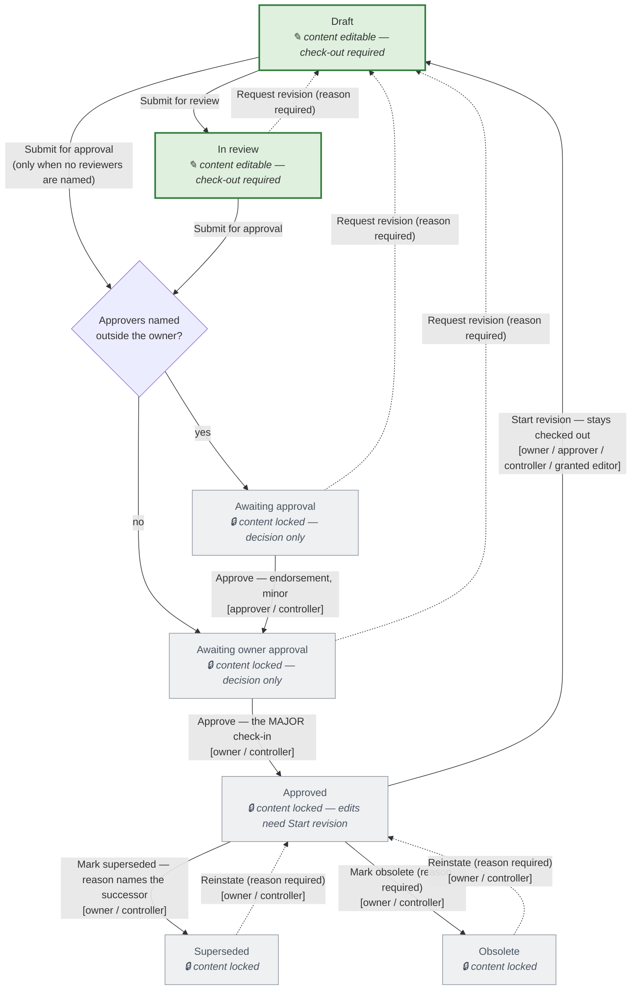
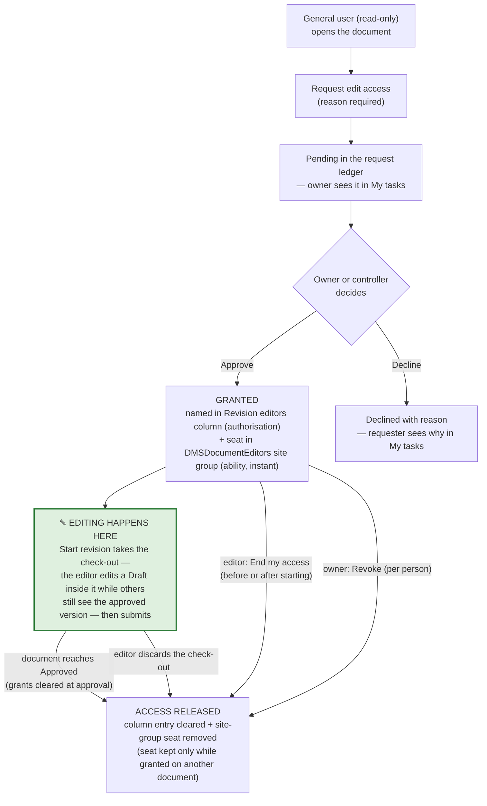

# Document control — lifecycle and roles

How LeanBoard's Standard Documents area controls a document, exactly as
implemented (v0.36.0). The source of truth for the rules is
`app/src/docs/model.ts` (`lifecycleCommandsFor`, `LifecycleGates`) and
`app/src/docs/accessRequests.ts`; this page is the picture of it.

Stages are the app's fixed vocabulary. Which SharePoint status *term*
expresses each stage is the site's choice, made once in
Settings → Documents → Lifecycle — commands write terms, queries match
terms, but the rules below are stated in stages.

## Roles

| Role | How it is held | What it allows |
| --- | --- | --- |
| **Document controller** | Member of the *Document Controllers* Entra group (linked in Settings → Access control). The doc-admin gate is this group **or** the app's super/site-admin roster role — so app admins are document admins automatically, but the reverse is not true. Fails closed: if the group can't be read, nobody is a controller. | Operational admin **within the documents area**: stand in at both approval steps on any document, start revisions, retire and reinstate, decide and revoke edit-access requests, add or replace by upload. **Not** app configuration: library exposure, the column dictionary, lifecycle mapping, group links and term-set sync live in Settings → Documents / Access control, which only the app **super-admin** role can open. |
| **Document owner** | Named in the document's *Owner* column. The picker is limited to the *Document Owners & Approvers* pool. | The final **Approve** (the one major version), request revision, start revision, mark superseded/obsolete and reinstate, approve/decline/revoke edit-access requests for their document, periodic **Mark reviewed**, edit properties, replace content while holding the check-out. |
| **Approver** | Named in the *Approvers* column. An owner listed as their own **sole** approver adds no extra step — only an approver *outside* the owner list creates the endorsement round. | Endorse at *Awaiting approval* (a minor check-in — the owner still gives the final word), request revision, start revision. |
| **Reviewer** | Named in the *Reviewers* column. | Their presence makes the review round **mandatory** — a draft with reviewers cannot go straight to approval. Reviewers do the content work in review and see those documents in *My tasks → Awaiting your review*. |
| **Revision editor** (temporary) | Granted per document via the request-access flow: named in the *Revision editors* column (the authorisation) **and** seated in the *DMSDocumentEditors* SharePoint site group (the ability — instant effect). | Drive one revision: start it, check out, edit, submit for review/approval. Never approve, never retire. Access is released automatically on every exit (see the second flowchart). |
| **General user** | Member of the app access group. Read-only on the standards libraries. | Read approved documents (the register shows *only Approved* by default), open shared permalinks and QR kiosks, and **request edit access** on a document. |
| *Owners & Approvers pool* | Member of the *Document Owners & Approvers* Entra group. | No rights by itself — it is who the Owner/Approvers/Reviewers pickers can name. Rights come from being named on a document. |

Submissions (for review, for approval) are deliberately open to anyone
who can write the document — SharePoint's own permissions are the real
gate there. Everything else is gated as drawn below.

## The lifecycle

### When can the content be edited?

The **editable window is Draft and In review** (green above) — the two
content stages. That is enforced, not convention: on a standards
library, check-out, edit, check-in, discard and *Replace content* are
offered only at those stages (`canEditContent`,
`app/src/docs/docsScreen.ts`); from *Awaiting approval* onward the
content is frozen and the document changes only through the lifecycle
commands. Three consequences:

- **Every edit rides a check-out.** The libraries require check-out, so
  even inside the window nothing changes until the editor holds the
  check-out — and only one person holds it at a time.
- **Approvers decide, they don't edit.** If sign-off reveals a problem,
  the road is *Request revision*, which reopens the window by putting
  the document back in Draft.
- **An approved document reopens only through Start revision**, which
  takes the check-out and holds the window *inside* it: the reviser
  edits a Draft while everyone else keeps seeing the approved version
  until a submit checks in. Editing properties while free uses a
  momentary check-out bracket and never moves the stage.

### The rules behind the arrows

- **Review is mandatory when reviewers are named.** A draft that names
  reviewers offers only *Submit for review*; the road to approval runs
  through them.
- **Approval is two steps when outside approvers are named.** Their
  *Approve* is an endorsement (minor) that moves the document to the
  owner; the owner's *Approve* is the one **major** check-in — the
  version an auditor reads. With no outside approvers, submission goes
  straight to the owner's stage. Controllers can stand in at either
  step (the deadlock-breaker), but no queue nags them — they act from
  the register.
- **Everything else is minor.** Submissions, endorsements, rejections
  and all of retirement are minor check-ins, so the approved major is
  never disturbed — which is exactly why *Reinstate* is a status write,
  not a re-approval.
- **Start revision keeps the world stable.** It checks the document out
  to the reviser and the draft status lives *inside* the check-out:
  everyone else keeps seeing the approved version until a submit checks
  in, and *Discard check-out* reverts the lot.
- **Request revision demands its reason** — a rejection that explains
  nothing teaches nothing. Retirement and reinstatement demand theirs
  too (superseded's reason names the successor: that is the audit
  trail).
- **Periodic review** sits outside the stage machine: approved
  standards with a *Next review date* surface in the owner's
  *Review due* queue, and **Mark reviewed** stamps the next date with a
  "Periodic review — no changes" check-in. The stage never moves.

## Requesting edit access (the temporary-editor road)

A general user who needs to revise a controlled document never gets
standing permissions — they get a per-document grant that releases
itself.

- **Authorisation vs ability.** The *Revision editors* column says who
  is allowed; the SharePoint site-group seat is what makes check-out
  physically work. Site-group membership is evaluated live per request,
  so a grant works on the next click (measured — the Entra route
  propagates too slowly to be usable).
- **Owners keep visibility.** *My tasks* shows owners every open grant
  they have made ("Edit access you granted") with per-person revoke;
  *Docs Health* reports drift in both directions (seats without grants,
  grants without seats).
- **Every exit releases.** Approval, discard, self-service end, revoke
  — there is no path that leaves a stale seat behind, and the seat
  survives only while some other document still grants that person.

## Where this is enforced

| Concern | Code |
| --- | --- |
| Stages, commands, gates | `app/src/docs/model.ts` — `LIFECYCLE_STAGES`, `LIFECYCLE_COMMANDS`, `lifecycleCommandsFor` |
| Controller gate (fails closed), pool pickers | `app/src/docs/accessGates.ts` |
| Request ledger, grants, releases | `app/src/docs/accessRequests.ts` |
| Task queues (approve / review / requests / grants) | `app/src/docs/docsScreen.ts` |
| Stage ↔ term mapping, drift findings | Settings → Documents → Lifecycle; `lifecycleHealth` |
